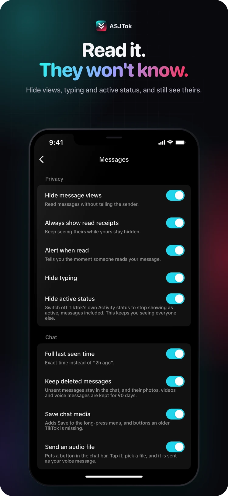
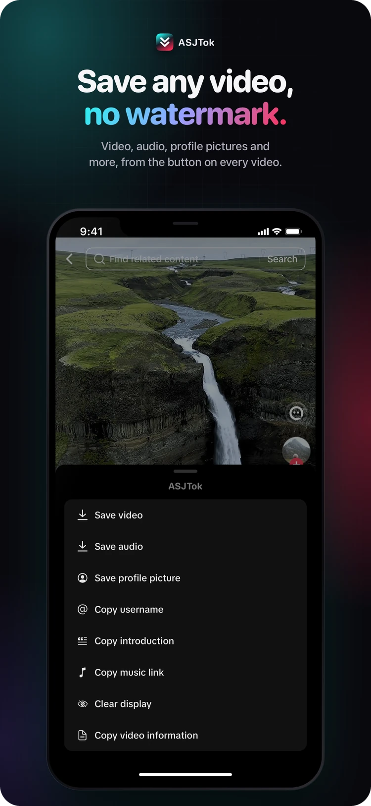
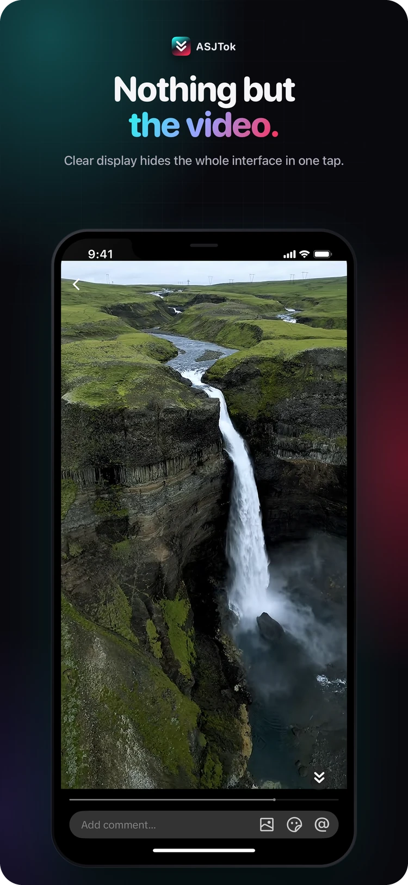
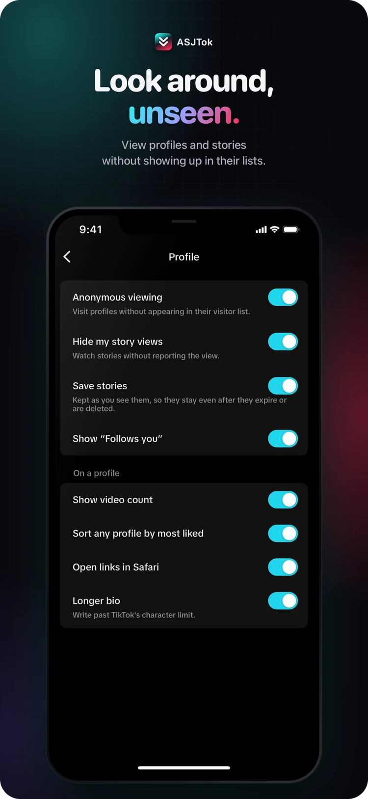
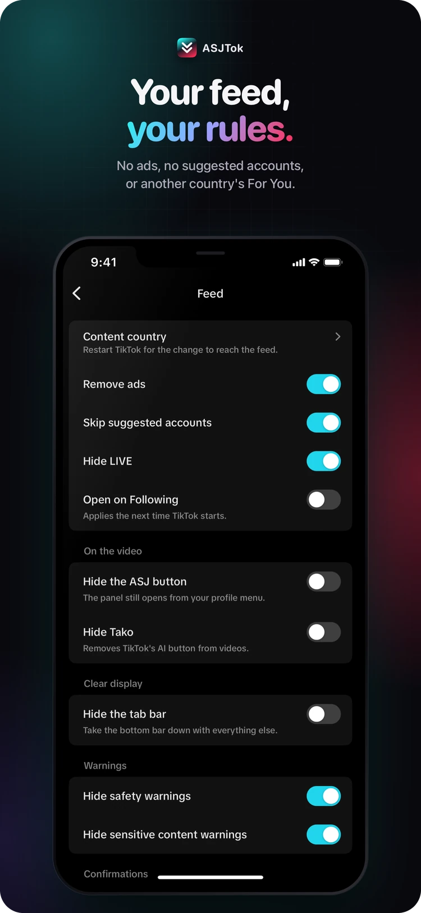
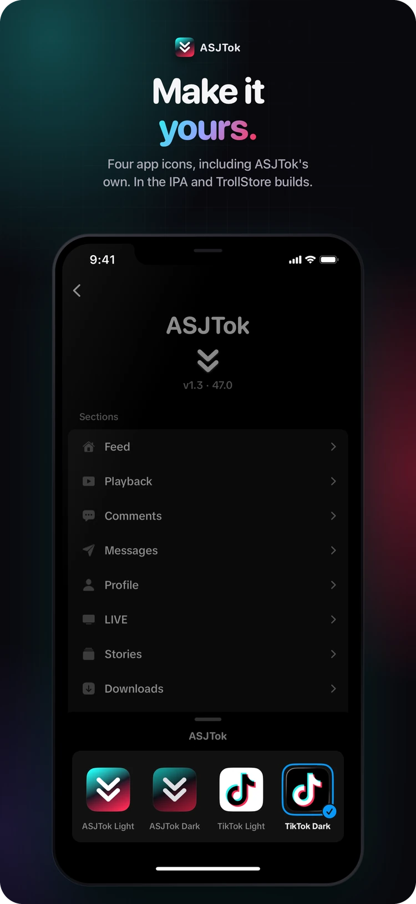

<div align="center">

<picture>
  <source media="(prefers-color-scheme: dark)" srcset="icon/icon-dark.png">
  
</picture>

# ASJTok

**Privacy, download and playback options for TikTok — without changing how the app looks.**

<sub>53 languages</sub>

Add the source in Sileo, Zebra, Cydia or Installer:

```
https://apt.ahmadrashed.com
```

Signing it yourself? `https://source.ahmadrashed.com` in ESign, Feather or KSign · `https://altstore.ahmadrashed.com` in AltStore or SideStore

[**ahmadrashed.com**](https://ahmadrashed.com) — the official website

[**ASJ Tweaks on Telegram**](https://t.me/ASJTweaks) — new tweaks and update notes

</div>

<p align="center">
  
  
  
</p>
<p align="center">
  
  
  
</p>

---

## Where it lives

Two ways in: a row inside your profile menu, under ASJ tools, and a row inside TikTok's own Settings.

The button on the right of any video opens the save menu: **Save video**, **Save audio**, **Save profile picture**, **Copy username**, **Copy introduction**, **Clear display** and **Copy video information**. On a photo post it saves the whole slideshow instead. The same options also sit in TikTok's own long-press sheet, under an ASJTok heading.

---

## Features

### Feed

- **Content country** — tell TikTok you are in another region
- **Remove ads**
- **Skip suggested accounts**
- **Hide LIVE**
- **Open on Following**
- **Hide safety warnings** and **sensitive content warnings**

### Playback

- **Auto scroll** — move to the next video when one ends
- **Prevent video loop** — pause at the end instead of replaying
- **Play sound in muted videos**
- **Always show progress bar**
- On the video: **country**, **like count** and **upload date**

### Messages

The three privacy switches are built to work **one way only** — you keep seeing everyone, they stop seeing you.

**Hide message views** — you read a message and the sender is never told. No "Seen" appears on their side, and it stays that way even if you open the chat, scroll it and reply later.

**Always show read receipts** — the catch with TikTok's own privacy switch is that it is mutual: turn read receipts off and you stop seeing theirs too. This keeps their "Seen" visible to you while yours stays hidden. Use it together with the one above and the exchange becomes one-sided in your favour.

**Alert when read** — the moment someone opens your message you get told, which is the piece TikTok never shows you.

**Hide active status** — same idea for the green "active now" dot. TikTok's own Activity status setting hides you *and* blinds you at the same time. This one switches it off for reporting only: you keep seeing who is active, in the inbox and inside chats, while nothing about you is sent. It does not just flip the setting — every path that reports your presence is stopped, cold launch, account switch and the periodic timer included, and the report request itself is refused if anything still tries.

**Full last seen time** — "2h ago" becomes the exact time.

**Keep deleted messages** — when someone unsends a message it stays in the chat instead of turning into "This message was deleted". You read what they took back.

**Save DM GIFs** — GIFs get a save option; photos and videos already use TikTok's own.

### Profile

**Anonymous viewing** — you can open any profile and no entry is added to their visitor list. The view is never reported, so there is nothing for them to see later either.

**Hide my story views** — watch a story and your name does not join the viewer list, even after you leave it. A tick marks it seen for you alone.

**Save stories** — every story you open is kept on your device as you saw it. Stories expire after a day and can be deleted by their owner; the copy you kept does not. They collect in their own screen inside the tweak, searchable by account, with a storage screen that shows where the space is going.

**Show "Follows you"** — the badge TikTok shows on some profiles and not others, shown consistently.

**Sort any profile by most liked** — TikTok gives that sort for your own profile only. This gives it for anyone's.

**Longer bio** — write past the character limit.

**Show video count** and **Open links in Safari** — small ones: the number of posts on a profile, and profile links opening in Safari instead of the in-app browser.

### Comments, LIVE and downloads

- **View disabled comments**, **longer comments**, **save comment media**
- **Auto like button** for LIVE — draggable, with a count limit
- **Remove watermark** and **clean copied links**
- **Save profile picture**, **copy username**, **copy bio**
- Saved stories are collected in their own screen, with storage shown per account

### Extras

**53 languages** — every language TikTok itself ships in. The panel follows TikTok's own language, so an Arabic install gets Arabic screens without setting anything, and a Language row lets you override it. Right-to-left languages mirror with the text: the arrows turn, the rows read from the right, and the badge on a profile says يتابعك.

**Clear Display** — one tap hides the entire interface: buttons, captions, tab bars, everything. The video plays clean, and a small button brings it all back. Useful for actually looking at a video, or for a screenshot without the clutter. A switch in Feed settings decides whether the bottom bar goes down with the rest.

**Content country** — pick a country and TikTok is told you are there: carrier, system region, timezone and app region all follow it.

**Remove watermark** — saved videos come without the TikTok watermark burned into the corner.

**Community tab** — TikTok sometimes opens with that tab missing from the top bar. It comes back within a moment instead of staying gone for the whole session.

---

## Install

### Jailbroken

Add the source above, or download a package from [Releases](../../releases) and install it with Sileo, Zebra or Cydia.

| Jailbreak | Package |
|---|---|
| Dopamine / palera1n (rootless) | `ASJTok` — `iphoneos-arm64` |
| checkra1n / unc0ver and similar (rootful) | `ASJTok` — `iphoneos-arm` |
| roothide | `ASJTok (roothide)` |

Sileo, Zebra and Cydia pick the right architecture on their own; roothide is a separate entry.

### TrollStore

Fully supported, with a build of its own that keeps TikTok's own entitlements and all nine app extensions intact.

**[ahmadrashed.com/trollstore/tiktok](https://ahmadrashed.com/trollstore/tiktok)** — iOS 14.0–16.6.1, and 17.0 on some devices.

One link: on an iPhone with TrollStore it hands the file straight over, anywhere else it just downloads.

### Not jailbroken, no TrollStore

Add `https://source.ahmadrashed.com` in ESign, Feather or KSign and install it from there — that source also has the full build, with TikTok's own extensions. In AltStore or SideStore, add `https://altstore.ahmadrashed.com`.

Or download the `.ipa` from [Releases](../../releases) and sign it with Sideloadly or ESign — or take the `.dylib` and inject it into your own copy of TikTok, then sign and install.

> The dylib is self-contained and does not need Cydia Substrate, so any injector works.
> TikTok itself is not distributed here — bring your own copy.

---

## Notes

- arm64 and arm64e
- The screens in the pictures are from a real install

<div align="center"><sub>by <a href="https://ahmadrashed.com">Ahmad Rashed</a></sub></div>
